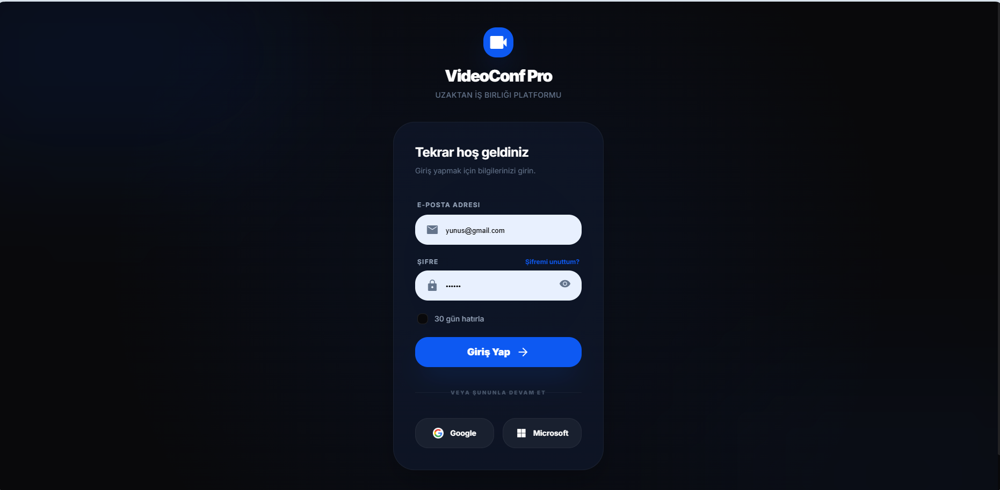
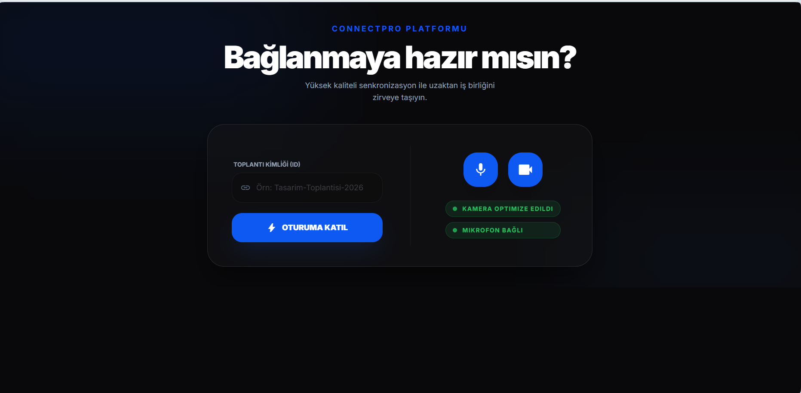
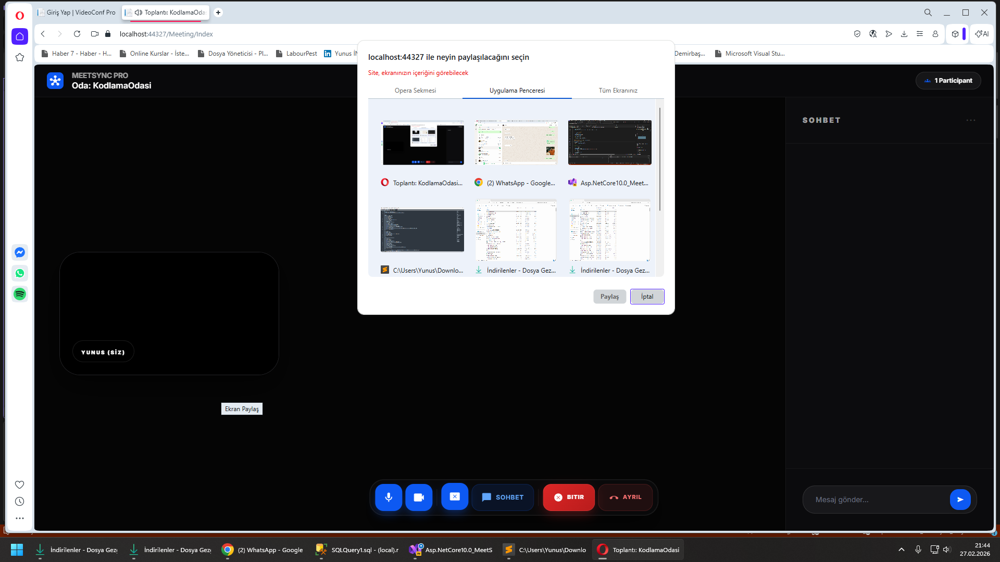
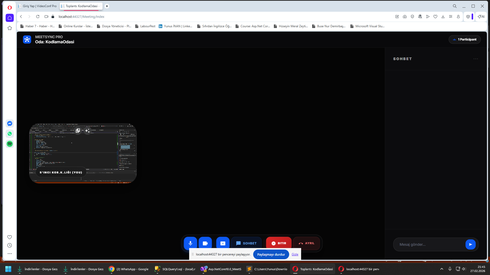
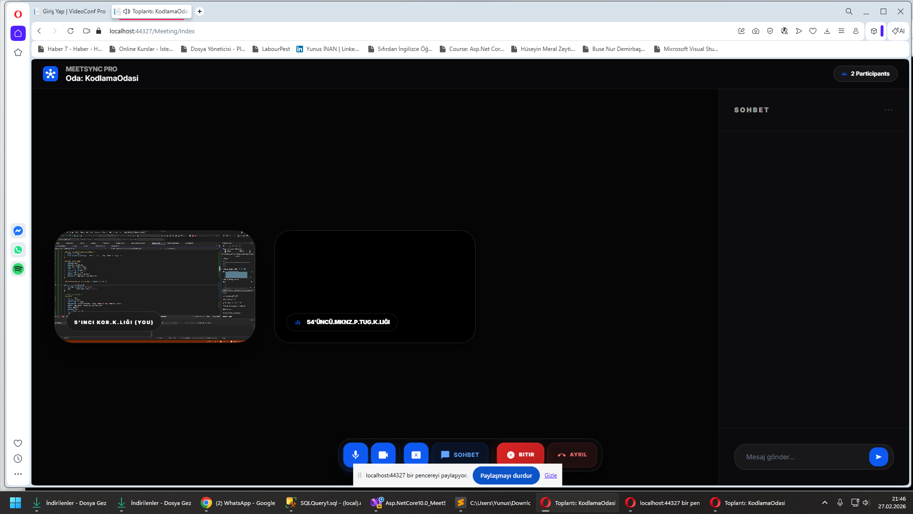
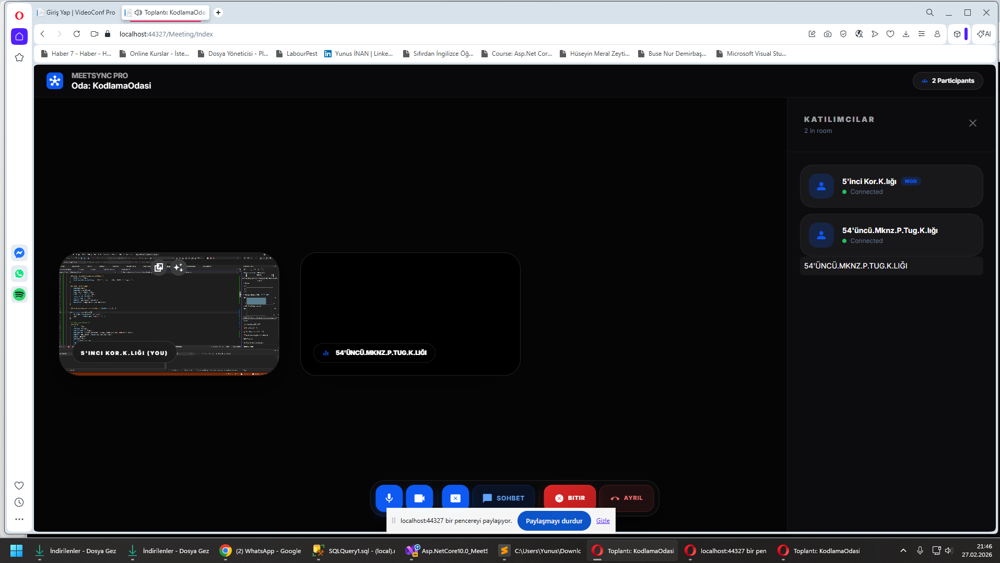
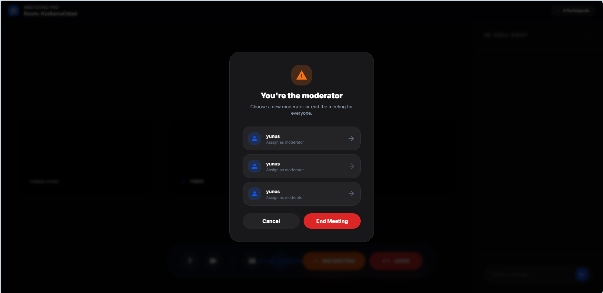
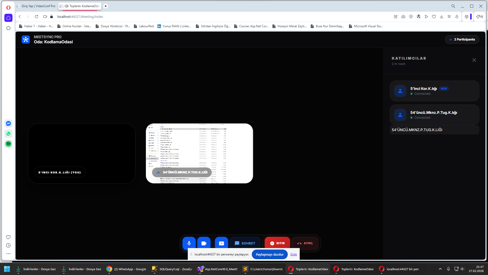
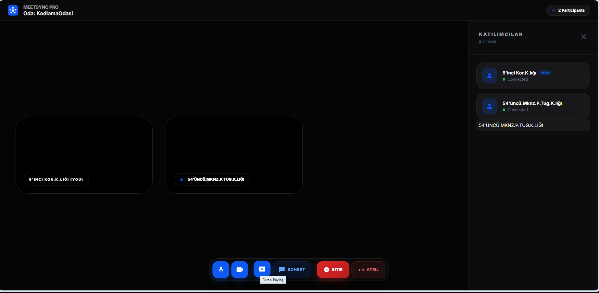

<p align="center">
  
</p>

<h1 align="center">MeetSync Pro — VideoConf Platform</h1>

<p align="center">
  <strong>ASP.NET Core 10.0 & WebRTC tabanlı, Stitch AI esintili premium video konferans deneyimi.</strong><br>
  Modern, hızlı ve güvenli gerçek zamanlı iş birliği aracı.
</p>

<p align="center">
  
  
  
</p>

---

## 🚀 Proje Hakkında

**MeetSync Pro**, uzak çalışma kültürünü bir üst seviyeye taşımak için tasarlanmış düşük gecikmeli bir video konferans uygulamasıdır.
Kullanıcı deneyimini odağına alan **Stitch AI tasarım dili**, karanlık mod ve glass-morphism efektleriyle modern bir arayüz sunar.

### 🌟 Öne Çıkan Özellikler

* **WebRTC Entegrasyonu:** Peer-to-peer (P2P) bağlantı ile düşük gecikmeli video ve ses aktarımı
* **SignalR Hub:** Gerçek zamanlı sinyalleşme, chat mesajları ve katılımcı yönetimi
* **Dinamik Oda Sistemi:** Benzersiz oda adlarıyla anında toplantı başlatma veya katılma
* **Premium UI:** Tailwind CSS ve Inter font ailesiyle modern arayüz
* **Oturum Yönetimi:** ASP.NET Core Session tabanlı kullanıcı takibi
* **In-Call Chat:** Toplantı sırasında gerçek zamanlı mesajlaşma

---

## 🖥️ Ekran Görüntüleri

### Karşılama ve Giriş Paneli



### Toplantı Bağlantı Ekranı



### Ana Görüşme Arayüzü



### Grid Görünümü



### Katılımcı ve Chat



### Toplantı Yönetimi



### Moderatör Paneli



### Ekran Paylaşımı



### Çoklu Paylaşım



---

## 🛠️ Teknik Altyapı

| Teknoloji       | Kullanım                  |
| --------------- | ------------------------- |
| **Backend**     | ASP.NET Core 10.0 (MVC)   |
| **Real-time**   | SignalR                   |
| **Video/Audio** | WebRTC                    |
| **Frontend**    | Tailwind CSS & JavaScript |
| **İkonlar**     | Material Symbols          |
| **Font**        | Inter                     |

---

## 🔧 Kurulum ve Çalıştırma

```bash
# 1️⃣ Repoyu klonla
git clone https://github.com/Terabithia1572/Asp.NetCore10.0_MeetSync_Project.git

# 2️⃣ Proje klasörüne gir
cd Asp.NetCore10.0_MeetSync_Project

# 3️⃣ Paketleri yükle
dotnet restore

# 4️⃣ Uygulamayı başlat
dotnet run
```

👉 Tarayıcı: **https://localhost:44327**

---

## 👤 Geliştirici

**Yunus İNAN**

🔗 GitHub: [Yunus İNAN](https://github.com/Terabithia1572)
🔗 LinkedIn: [Yunus İNAN](https://www.linkedin.com/in/yunus-inan-550327214/)

---

## 📄 Lisans

Bu proje kişisel gelişim ve eğitim amacıyla geliştirilmiştir.
Ticari kullanım için iletişime geçebilirsiniz.

<p align="right"><a href="#top">Başa dön ↑</a></p>
