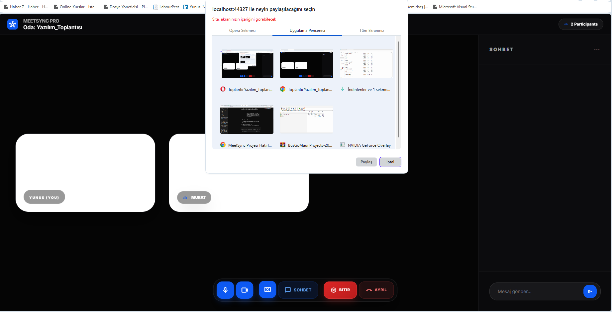
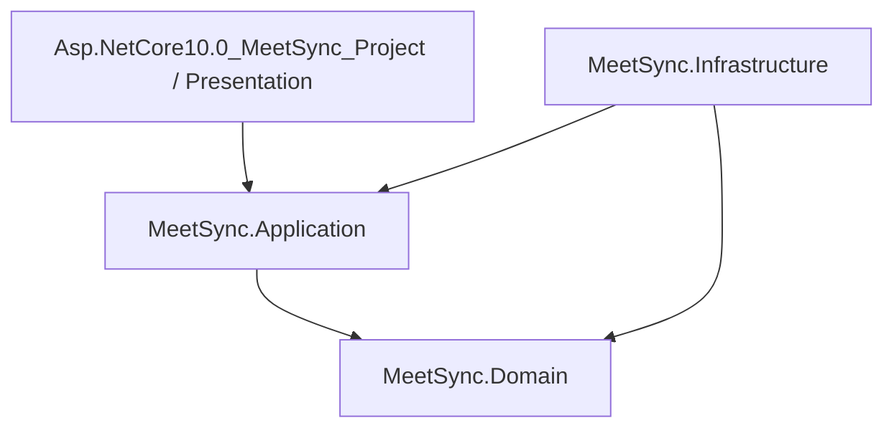

# MeetSync Pro 🚀
### Enterprise Real-Time WebRTC & SignalR Video Conferencing Architecture (.NET 10)

MeetSync Pro is a high-performance, real-time video conferencing platform built on **.NET 10**, **SignalR Core**, **WebRTC Peer-to-Peer Mesh**, and **Redis Distributed Backplane**. Designed according to strict **Clean Architecture** principles, MeetSync Pro supports ultra-low latency audio/video streaming, advanced host moderation controls, MediaRecorder meeting recording, Web Speech API live captions, and NLP meeting summarization.

---

## 📸 Screenshots Gallery

| Screen | Preview | Description |
| :--- | :--- | :--- |
| **User Authentication** |  | Secure registration and login portal |
| **Meeting Dashboard** |  | Room creation, instant join, and active rooms overview |
| **Dashboard Interface** |  | Expanded user workspace and meeting management |
| **Live WebRTC Session** |  | Ultra-low latency multi-peer video grid with custom controls |
| **Screen Sharing** |  | HD screen and window broadcasting |
| **Active Participants** |  | Real-time participant list with host controls |
| **Real-Time Chat** |  | Instant message broadcasting over SignalR |
| **Moderator Controls** |  | Lobby approval, participant muting, kicking, and room locking |

---

## 🏗️ Clean Architecture Overview

MeetSync Pro is partitioned into four decoupled layers following domain-driven Clean Architecture principles:


```mermaid
graph TD
    UI[Asp.NetCore10.0_MeetSync_Project / Presentation] --> Application[MeetSync.Application]
    Infrastructure[MeetSync.Infrastructure] --> Application
    Infrastructure --> Domain[MeetSync.Domain]
    Application --> Domain
```

### 1. `MeetSync.Domain` (Core Business Layer)
* **Entities:** `Room`, `User`, `MeetingRecording`, `MeetingTranscript`, `MeetingSummary`.
* **Value Objects & Enums:** Room state, participant roles, recording status (`Processing`, `Completed`, `Failed`).
* **Exceptions:** Custom `DomainException` and formatted `ValidationException`.

### 2. `MeetSync.Application` (Business Logic & Contracts)
* **Service Interfaces:** `IRoomService`, `IAuthService`, `IMeetingService`, `IMeetingStateStore`, `IMeetingRecordingService`, `ITranscriptionService`, `IAiSummaryService`.
* **DTO Pipeline:** Strongly-typed Request/Response DTOs for Room, Auth, Recording, and AI Summaries.
* **Pipeline Validation:** `FluentValidation` validators enforcing Turkish character support (`a-zA-Z0-9\s\-_çğıöşüÇĞİÖŞÜ`), valid emails, password complexity, and robust GUID fallback handling.

### 3. `MeetSync.Infrastructure` (Data & External Integration)
* **Database Access:** Entity Framework Core `MeetSyncDbContext` with migrations for moderation, recording, and transcript persistence.
* **Service Implementations:** `RoomService`, `AuthService`, `MeetingService`, `MeetingRecordingService`, `TranscriptionService`, `AiSummaryService`.
* **Distributed State Engine:** `InMemoryMeetingStateStore` and `RedisMeetingStateStore` for atomic participant/room tracking.

### 4. `Asp.NetCore10.0_MeetSync_Project` (Presentation & Web API)
* **SignalR Hub:** Thin, lock-synchronized `MeetingHub.cs` handling WebRTC signaling (`SendOffer`, `SendAnswer`, `SendIceCandidate`), lobby queueing, live captions, and recording stream chunking.
* **Controllers:** `DashboardController`, `MeetingController`, `RoomController`, `RecordingsController`, `AiSummaryController`.
* **Middlewares:** Native .NET 10 `GlobalExceptionHandler` returning RFC 7807 `ProblemDetails`, `SecurityHeadersMiddleware`, Serilog structured JSON logging, and ASP.NET Core Native Rate Limiting.

---

## ✨ Enterprise Features & Modules

### 👑 Module 1: Advanced Moderation & Lobby System
* **Waiting Room / Lobby:** Non-host participants are placed in a waiting queue when `IsLobbyEnabled` is active. Moderators receive `UserWaitingInLobby` notifications and can approve or reject participants in real time (`ApproveParticipant`, `RejectParticipant`).
* **Room Locking:** Hosts can lock rooms via `SetRoomLock` to prevent new attendees from joining active sessions.
* **Password Protection:** Optional password verification during join requests (`VerifyPasswordAsync`).
* **Remote Host Commands:** Host capability to remotely mute participant audio/video (`MuteParticipant`, `MuteAllParticipants`) or forcibly eject disruptive users (`KickParticipant`).

### 🎥 Module 2: Meeting Recording Engine
* **Browser MediaRecorder Chunking:** Streams Opus/VP8 WebM video chunks from client browsers to the server in 3-second intervals over `UploadRecordingChunk`.
* **Storage Assembly:** Appends binary chunks sequentially to configured disk storage (`wwwroot/recordings`).
* **REST API:** `RecordingsController` provides endpoints for querying recorded session metadata and playback.

### 🎙️ Module 3: AI Live Captions & Meeting Summarization
* **Web Speech API Integration:** Captures live Turkish/English Speech-to-Text and broadcasts live captions (`SendTranscriptionChunk` $\rightarrow$ `ReceiveLiveCaption`).
* **Transcript Persistence:** Automatically stores time-stamped speech chunks in EF Core `MeetingTranscript` table.
* **AI NLP Summarization:** Generates structured meeting summaries, key decisions, and actionable task items via `IAiSummaryService` and `AiSummaryController`.

---

## ⚡ Distributed Scalability & Redis Backplane

To support horizontal scaling across multi-node server clusters, MeetSync Pro provides a dual-state backend:

* **`RedisMeetingStateStore`:** Uses Redis Hashes and Keys to store active rooms, connection mappings, and waiting lists across cluster nodes without requiring sticky sessions.
* **SignalR Redis Backplane:** Enabled via `.AddStackExchangeRedis()`, distributing WebSocket events across all web nodes seamlessly.
* **`InMemoryMeetingStateStore`:** High-performance fallback store using `ConcurrentDictionary` and per-room lock synchronization for local development and single-node deployments.

---

## 🛡️ Security & Observability

* **RFC 7807 ProblemDetails:** Standardized error format delivered via `GlobalExceptionHandler` (.NET 10 `IExceptionHandler`).
* **Security Headers:** Enforces `X-Frame-Options: DENY`, `X-Content-Type-Options: nosniff`, `Referrer-Policy: strict-origin-when-cross-origin`, and `Content-Security-Policy`.
* **Rate Limiting:** Concurrency and fixed-window rate limiters protecting authentication endpoints (`AuthPolicy`) and SignalR signaling streams (`SignalRPolicy`).
* **Serilog Structured Logging:** JSON-formatted logs with property contextualization (`RoomId`, `UserId`, `TraceId`).

---

## 📈 K6 Load Testing & Benchmarks

MeetSync Pro includes an automated **K6 load testing script** located in `/tests/load-testing/meetsync-signalr-loadtest.js`.

### Target SLA Benchmarks

| Metric | SLA Target | Implementation |
| :--- | :--- | :--- |
| **Concurrent WebRTC Peers per Node** | 500 Active Connections | Non-blocking SignalR Async I/O |
| **WebSocket Throughput** | 10,000+ Msgs / Sec | Optimized JSON / Binary Pipelines |
| **Connection Latency (p95)** | < 150 ms | Ephemeral Socket Expansion |
| **Signaling Message RTT (p95)** | < 50 ms | Lock-free State Stores |
| **Error Rate Threshold** | < 0.01% | Resilient Exception Handling |

### Executing K6 Load Tests

```bash
# Run K6 SignalR Load Test
k6 run --env TARGET_URL=ws://localhost:5252/meetingHub tests/load-testing/meetsync-signalr-loadtest.js
```

---

## 🚀 Getting Started

### Prerequisites
* [.NET 10 SDK](https://dotnet.microsoft.com/)
* SQL Server / LocalDB or SQLite
* Redis Server (Optional, for cluster scaling)

### Installation & Execution

1. **Clone the Repository:**
   ```bash
   git clone https://github.com/Terabithia1572/Asp.NetCore10.0_MeetSync_Project.git
   cd Asp.NetCore10.0_MeetSync_Project
   ```

2. **Restore & Build Solution:**
   ```bash
   dotnet build
   ```

3. **Apply Database Migrations:**
   ```bash
   dotnet ef database update --project MeetSync.Infrastructure --startup-project Asp.NetCore10.0_MeetSync_Project
   ```

4. **Run Application:**
   ```bash
   dotnet run --project Asp.NetCore10.0_MeetSync_Project
   ```

5. **Access Application:**
   Navigating to `http://localhost:5252` or `https://localhost:7252`.
   Swagger API Documentation available at `http://localhost:5252/swagger`.

---

## 📄 License
This project is licensed under the MIT License.
