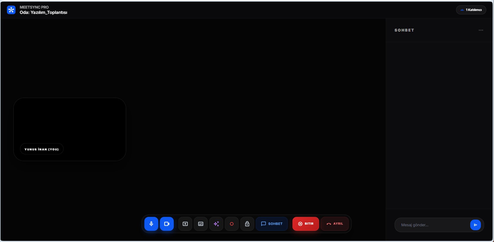
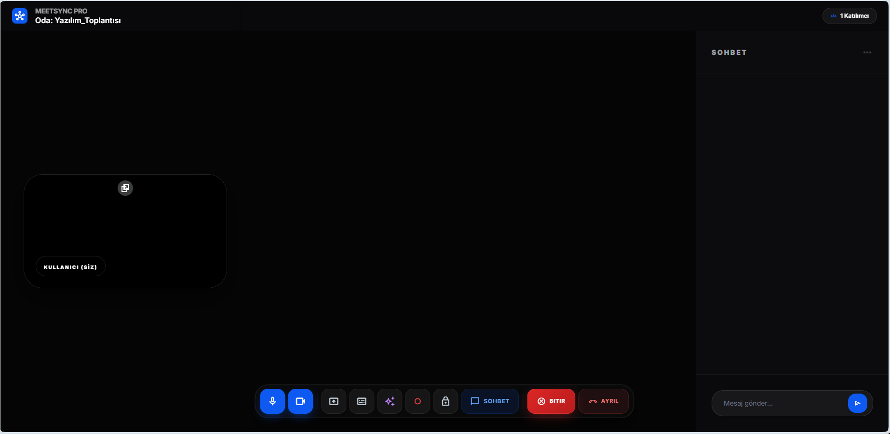
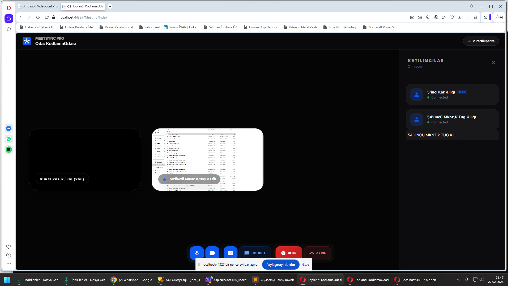
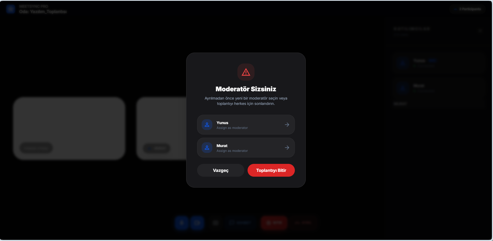

# MeetSync Pro 🚀
### Enterprise Real-Time WebRTC & SignalR Video Conferencing Architecture (.NET 10)
### Kurumsal Gerçek Zamanlı WebRTC & SignalR Video Konferans Mimarisi (.NET 10)

[**TR**](#-türkçe-dokümantasyon) | [**EN**](#-english-documentation)

---

## 🇹🇷 Türkçe Dokümantasyon

MeetSync Pro, **.NET 10**, **SignalR Core**, **WebRTC Peer-to-Peer Mesh** ve **Redis Distributed State Engine** teknolojileri üzerinde geliştirilmiş, yüksek performanslı ve dağıtık mimariye sahip kurumsal bir video konferans platformudur.

### 📸 Ekran Görüntüleri Galerisi

| Görünüm | Önizleme | Açıklama |
| :--- | :--- | :--- |
| **Kullanıcı Girişi** |  | Güvenli kullanıcı kayıt ve giriş portalı |
| **Toplantı Paneli** |  | Oda oluşturma, hızlı katılım ve aktif odalar listesi |
| **Panel Arayüzü** |  | Genişletilmiş toplantı yönetim alanı |
| **Canlı Görüntülü Görüşme** |  | Düşük gecikmeli çoklu katılımcı video ızgarası |
| **Ekran Paylaşımı** |  | HD kalitede ekran ve uygulama penceresi yayını |
| **Katılımcı Listesi** |  | Anlık katılımcı yönetimi ve host kontrolleri |
| **Canlı Sohbet** |  | SignalR tabanlı anlık mesajlaşma |
| **Moderasyon Kontrolleri** |  | Bekleme odası onayı, sessize alma, çıkarma ve oda kilitleme |

---

### 🏗️ Temiz Mimari (Clean Architecture) Yapısı

MeetSync Pro, Domain-Driven Design (DDD) ve Clean Architecture prensiplerine göre 4 ayrıştırılmış katmandan oluşur:

* **`MeetSync.Domain` (Çekirdek Varlıklar):**
  * **Entities:** `Room`, `User`, `MeetingRecording`, `MeetingTranscript`, `MeetingSummary`.
  * **Enums & Exceptions:** `RecordingStatus`, `DomainException`, `ValidationException`.
* **`MeetSync.Application` (İş Mantığı ve Sözleşmeler):**
  * **Interfaces:** `IRoomService`, `IAuthService`, `IMeetingService`, `IMeetingStateStore`, `IMeetingRecordingService`, `ITranscriptionService`, `IAiSummaryService`.
  * **DTO Pipeline & FluentValidation:** Türkçe karakter desteği (`a-zA-Z0-9\s\-_çğıöşüÇĞİÖŞÜ`), email ve şifre kurallarını doğrulayan pipeline.
* **`MeetSync.Infrastructure` (Veri ve Dış Entegrasyonlar):**
  * **EF Core & Database:** `MeetSyncDbContext` veritabanı erişimi ve EF Core Migration yapısı.
  * **State Engines:** Tek sunucu için lock-synchronized `InMemoryMeetingStateStore`, küme sunucular için `RedisMeetingStateStore`.
* **`Asp.NetCore10.0_MeetSync_Project` (Sunum ve Web API):**
  * **SignalR Hub:** WebRTC sinyalleşmesini (`SendOffer`, `SendAnswer`, `SendIceCandidate`), canlı altyazıyı ve kayıt akışlarını yöneten thread-safe `MeetingHub.cs`.
  * **Middleware & Controls:** RFC 7807 `ProblemDetails` exception handler, Serilog loglama, Güvenlik Başlıkları (`SecurityHeadersMiddleware`) ve Rate Limiting.

---

### 👑 Kurumsal Özellik Modülleri

1. **Gelişmiş Moderasyon & Bekleme Odası (Lobby):**
   * Bekleme odası aktif olan odalarda non-host kullanıcılar onay kuyruğuna alınır. Moderatör SignalR üzerinden onaylayabilir (`ApproveParticipant`) veya reddedebilir (`RejectParticipant`).
   * Moderatör odayı kilitleyebilir (`SetRoomLock`) veya kullanıcıları uzaktan sessize alabilir/odadan çıkarabilir (`MuteParticipant`, `KickParticipant`).
2. **Toplantı Kayıt Motoru (Recording Engine):**
   * Tarayıcı `MediaRecorder` API üzerinden 3 saniyelik WebM video dilimleri SignalR ile sunucuya iletilir (`UploadRecordingChunk`) ve yerel depolama alanına birleştirilir.
3. **Yapay Zeka Canlı Altyazı & Toplantı Özetleme:**
   * Web Speech API ile canlı Türkçe/İngilizce konuşma metne dönüştürülür (`ReceiveLiveCaption`).
   * Konuşma dökümleri `MeetingTranscript` tablosunda saklanır. `IAiSummaryService` ile genel özet, alınan kararlar ve aksiyon maddeleri üretilir.

---

## 🇬🇧 English Documentation

MeetSync Pro is an enterprise video conferencing system engineered with **.NET 10**, **SignalR Core**, **WebRTC Peer-to-Peer Mesh**, and **Redis Distributed State Engine**.

### 📸 Screenshots Gallery

| View | Preview | Description |
| :--- | :--- | :--- |
| **Authentication** |  | Secure login and user registration portal |
| **Meeting Dashboard** |  | Room creation, quick join, and room list |
| **Live Session** |  | Ultra-low latency WebRTC video mesh grid |
| **Screen Share** |  | High-definition screen and browser window sharing |
| **Moderation Controls** |  | Lobby approval, remote participant muting, kicking, and room lock |

---

### 🏗️ Clean Architecture Overview

MeetSync Pro follows Domain-Driven Design (DDD) Clean Architecture split into four distinct layers:

1. **`MeetSync.Domain`:** Encapsulates domain entities (`Room`, `User`, `MeetingRecording`, `MeetingTranscript`, `MeetingSummary`), value objects, and custom exceptions.
2. **`MeetSync.Application`:** Defines service abstractions (`IRoomService`, `IMeetingStateStore`, `IAiSummaryService`), DTOs, and FluentValidation rules with full Turkish character support.
3. **`MeetSync.Infrastructure`:** EF Core database context, migrations, service implementations, and dual-state backends (`InMemoryMeetingStateStore` and `RedisMeetingStateStore`).
4. **`Asp.NetCore10.0_MeetSync_Project`:** Presentation layer containing SignalR `MeetingHub.cs`, Web API controllers, RFC 7807 `GlobalExceptionHandler`, Serilog logging, and security middleware.

---

### ⚡ Distributed Scalability & Redis Backplane

* **`RedisMeetingStateStore`:** Manages room participants, connection mappings, and lobby queues using fast Redis Hashes and Keys.
* **SignalR Redis Backplane:** Broadcaster cluster scaling via `.AddStackExchangeRedis()`, enabling multi-node web server deployment without sticky session requirements.

---

### 📈 K6 Load Testing & Benchmark Metrics

Included K6 load test script: `/tests/load-testing/meetsync-signalr-loadtest.js`.

| Metric | Target SLA | Implementation |
| :--- | :--- | :--- |
| **Concurrent WebRTC Peers / Node** | 500 Active Connections | Thin SignalR Hub & Async Pipelines |
| **WebSocket Throughput** | 10,000+ Msgs / Sec | Non-blocking Sockets |
| **Connection Latency (p95)** | < 150 ms | Redis Distributed Caching |
| **Signaling Message RTT (p95)** | < 50 ms | Lock-free `ConcurrentDictionary` / Redis |
| **Error Rate Threshold** | < 0.01% | Resilient Exception Handlers |

```bash
# Execute K6 Load Test
k6 run --env TARGET_URL=ws://localhost:5252/meetingHub tests/load-testing/meetsync-signalr-loadtest.js
```

---

## 🚀 Getting Started / Kurulum ve Çalıştırma

```bash
# 1. Clone repository / Depoyu klonlayın
git clone https://github.com/Terabithia1572/Asp.NetCore10.0_MeetSync_Project.git
cd Asp.NetCore10.0_MeetSync_Project

# 2. Build solution / Projeyi derleyin
dotnet build

# 3. Update Database / Veritabanını güncelleyin
dotnet ef database update --project MeetSync.Infrastructure --startup-project Asp.NetCore10.0_MeetSync_Project

# 4. Run Application / Uygulamayı çalıştırın
dotnet run --project Asp.NetCore10.0_MeetSync_Project
```

Access application at `http://localhost:5252` | Swagger documentation at `http://localhost:5252/swagger`.

---

## 📄 License
This project is licensed under the MIT License.
