# Terabithia Sync — MeetSync Pro

[TR: Türkçe](#türkçe) | [EN: English](#english)

---

<a name="türkçe"></a>
# 🇹🇷 Türkçe Dokümantasyon

## 1. Proje Başlığı ve Tanıtım

**Terabithia Sync — MeetSync Pro**, modern web teknolojileri (ASP.NET Core 10, SignalR ve WebRTC) üzerinde geliştirilmiş, yüksek performanslı, güvenli ve düşük gecikmeli gerçek zamanlı görüntülü toplantı, sesli iletişim, ekran paylaşımı ve moderasyon platformudur.

### Çözdüğü Problem
Geleneksel toplantı yazılımlarının gerektirdiği ağır masaüstü istemcileri, yüksek sunucu bant genişliği maliyetleri ve karmaşık lisanslama modellerine alternatif olarak; tamamen tarayıcı tabanlı (Peer-to-Peer), doğrudan uçtan uca şifrelenmiş medya aktarımı ve kurumsal seviyede katmanlı Clean Architecture mimarisi sunar.

### Öne Çıkan Değerler
- **Doğrudan Tarayıcı İletişimi**: WebRTC P2P (RTCPeerConnection) altyapısı sayesinde görüntü ve ses aktarımı sunucu yükünü minimuma indirir.
- **Gerçek Zamanlı Moderasyon**: Odaları kilitleme, katılımcıları susturma/odadan çıkarma, moderatör yetkisi devretme ve bekleme odası (lobi) yönetimi.
- **Sunucu Taraflı Toplantı Kaydı**: Katılımcı akışlarını 1280x720 (720p) çözünürlükte WebM biçiminde kesintisiz birleştirip kaydetme.
- **Yüksek Çözünürlüklü Ekran Paylaşımı**: 480p'den 4K (UHD 3840x2160) çözünürlüğe kadar dinamik ekran yayın kalitesi seçimi.

**Geliştirici**: Yunus İNAN ([GitHub Profili](https://github.com/Terabithia1572))

---

## 2. İçindekiler (TR)
- [1. Proje Başlığı ve Tanıtım](#1-proje-başlığı-ve-tanıtım)
- [3. Ekran Görüntüleri](#3-ekran-görüntüleri-tr)
- [4. Özellikler](#4-özellikler-tr)
  - [Son Eklenen Özellikler](#son-eklenen-özellikler)
- [5. Teknoloji Yığını](#5-teknoloji-yığını-tr)
- [6. Mimari](#6-mimari-tr)
- [7. Çalışma Akışı](#7-çalışma-akışı-tr)
- [8. Gereksinimler ve Kurulum](#8-gereksinimler-ve-kurulum-tr)
- [9. Yapılandırma](#9-yapılandırma-tr)
- [10. Kullanım Kılavuzu](#10-kullanım-kılavuzu-tr)
- [11. Testler ve Doğrulama](#11-testler-ve-doğrulama-tr)
- [12. Sorun Giderme](#12-sorun-giderme-tr)
- [13. Bilinen Sınırlamalar](#13-bilinen-sınırlamalar-tr)
- [14. Katkıda Bulunma](#14-katkıda-bulunma-tr)
- [15. Geliştirici](#15-geliştirici-tr)
- [16. Lisans ve Telif](#16-lisans-ve-telif-tr)

---

<a name="3-ekran-görüntüleri-tr"></a>
## 3. Ekran Görüntüleri (TR)

Uygulamanın yenilenen arayüz bileşenleri ve kullanıcı deneyimi görselleri aşağıda sunulmuştur:

| Görünüm | Açıklama |
| :--- | :--- |
| 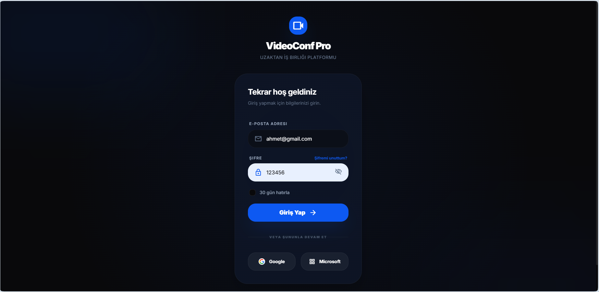 | **Giriş ve Oturum Açma**: Güvenli kullanıcı kimlik doğrulaması ve oturum yönetimi. |
| 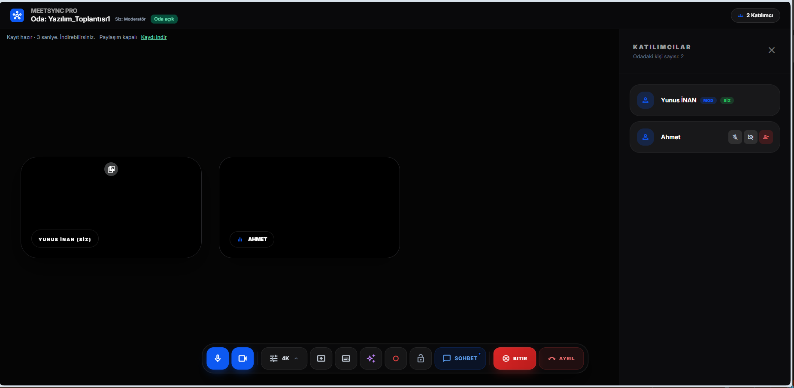 | **Ana Kontrol Paneli**: Hızlı toplantı başlatma, oda arama ve istatistikler. |
| 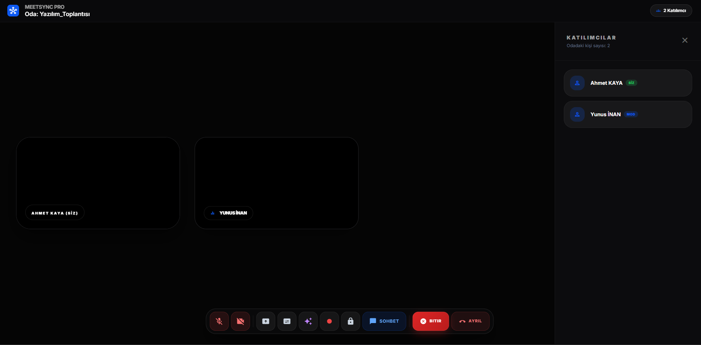 | **Oda Oluşturma**: Özel şifre ve lobi seçenekleriyle yeni toplantı odası tanımlama. |
| 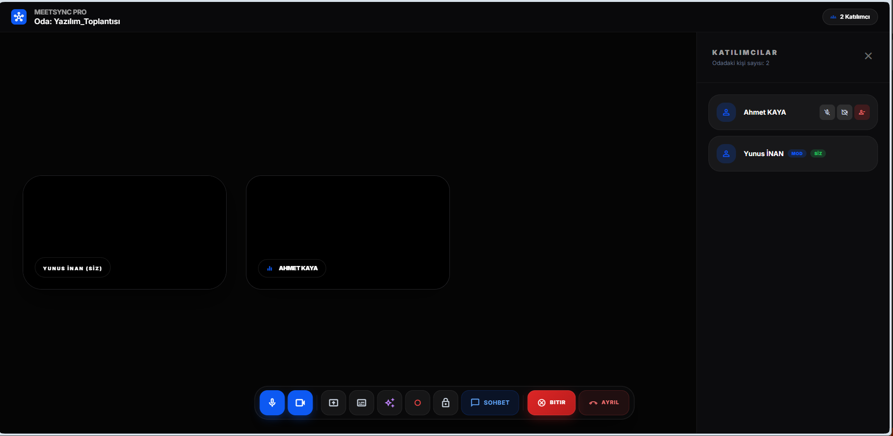 | **Aktif Odalar Listesi**: Mevcut odaları görüntüleme ve anında katılım sağlama. |
|  | **Oda Dizini Görünümü**: Tüm aktif canlı oturumların listelenmesi. |
| 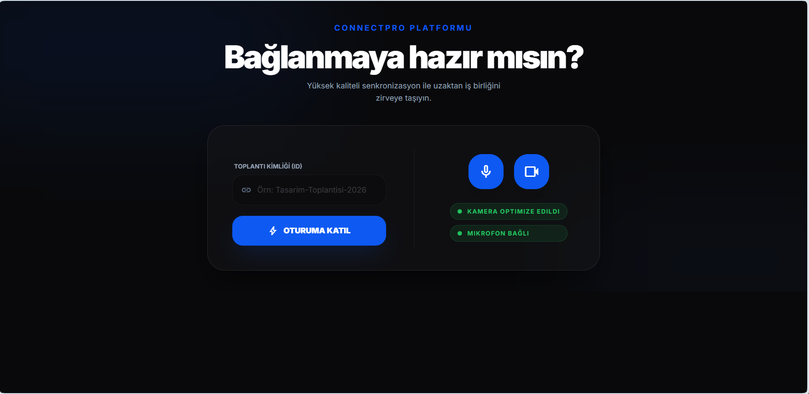 | **Bekleme Odası (Lobi)**: Toplantı öncesi kamera, mikrofon ve cihaz izinleri kontrolü. |
| 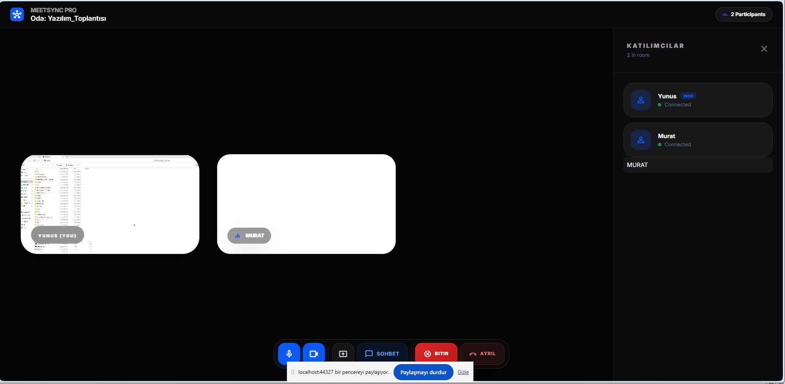 | **Katılımcılar Listesi**: Canlı katılımcı durumu, rol göstergeleri ve eylemler. |
| 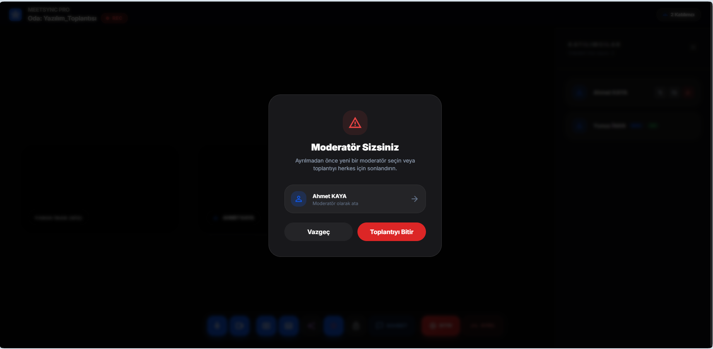 | **Moderatör Kontrolleri**: Susturma, atma, odayı kilitleme ve kayıt başlatma butonları. |
| 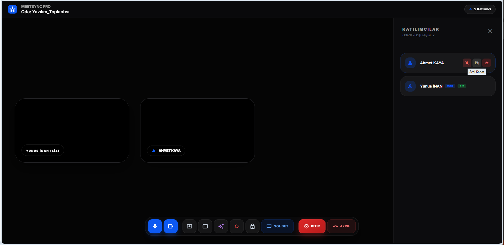 | **Medya Araç Çubuğu**: Mikrofon, kamera ve ekran paylaşımı hızlı açma/kapama. |
| 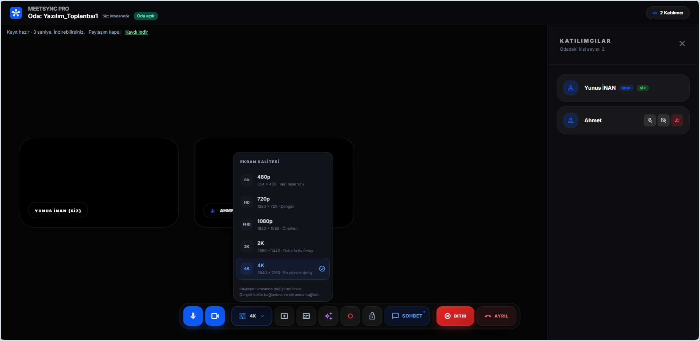 | **Kalite Seçim Paneli**: 480p, 720p, 1080p, 2K ve 4K ekran paylaşımı kalite menüsü. |
| 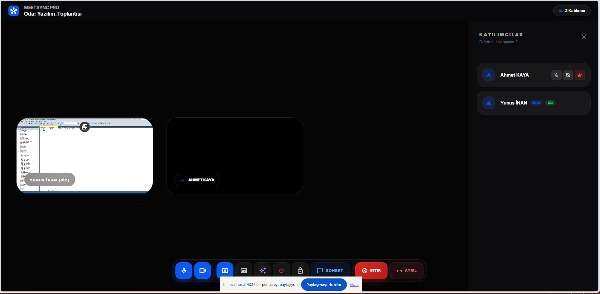 | **Canlı Ekran Paylaşımı**: Yüksek kare hızlı canlı ekran yayını ve kompakt kalite rozeti. |
| 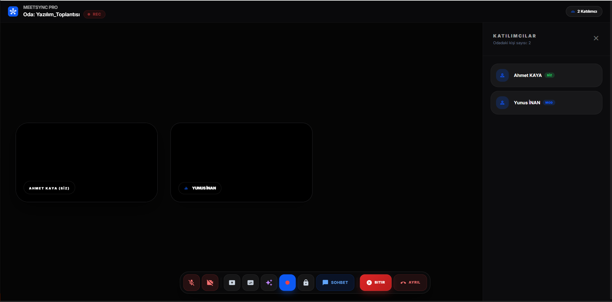 | **Toplantı Kaydı**: Canlı kayıt göstergesi, süre takibi ve indirme bağlantısı. |
| 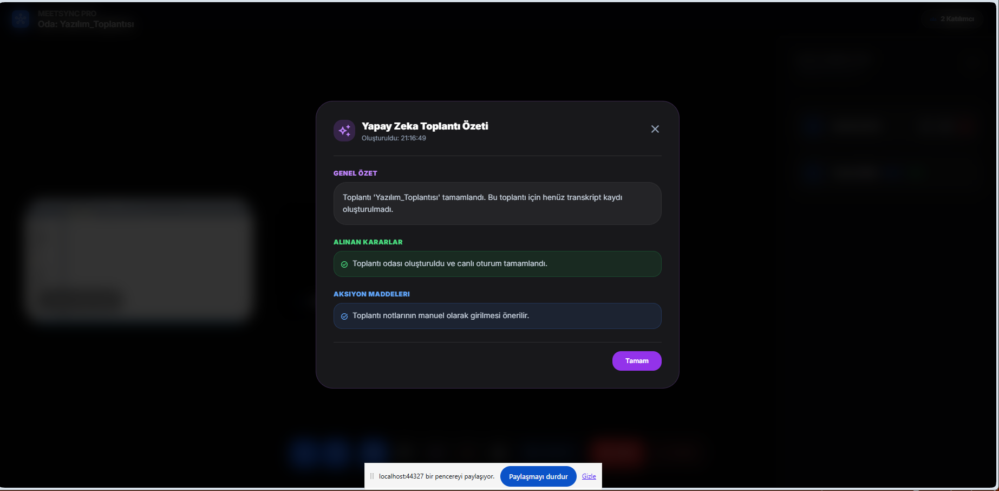 | **AI Toplantı Özeti**: Otomatik canlı altyazı ve NLP tabanlı toplantı özeti. |
| 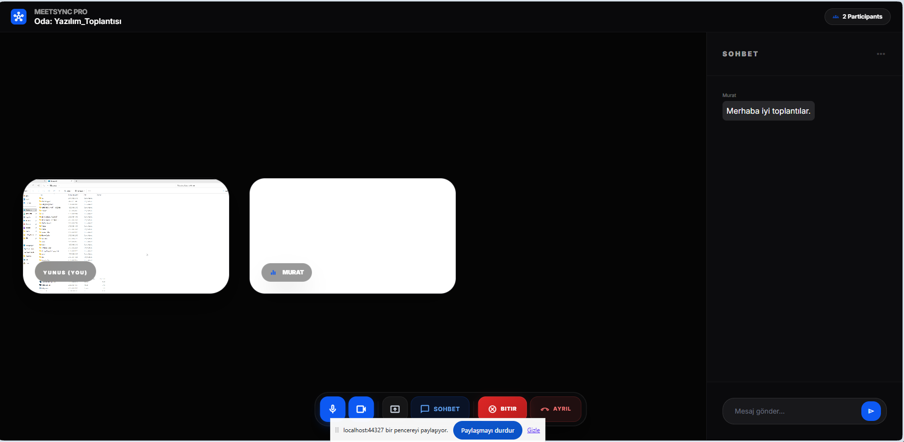 | **Toplantı İçi Sohbet**: Anlık mesajlaşma ve dosya/bağlantı paylaşım paneli. |

---

<a name="4-özellikler-tr"></a>
## 4. Özellikler (TR)

### 🌟 Son Eklenen Özellikler

1. **Aynı Aktif Odaya Katılma Koruması (`sp_getapplock` & Collate)**:
   - Aynı isimde aktif bir oda bulunuyorsa yeni oda oluşturulmaz; kullanıcı mevcut aktif odaya yönlendirilir.
   - Eşzamanlı oluşturma isteklerinde veritabanı düzeyinde `sys.sp_getapplock` kilit mekanizması kullanılır.
   - Oda adlarında boşluklar temizlenir (`FormC` Unicode normalizasyonu) ve Türkçe harf duyarlı (`Turkish_100_CI_AS`) birebir karşılaştırma yapılır.
   - SQL `LIKE` arama Joker karakteri riski oluşturan alt çizgi (`_`) gibi karakterler düzgün işlenir.

2. **Toplantı Kayıt Motoru (MediaRecorder Stream Chunking)**:
   - Moderatör tarafından tek tıkla başlatılıp durdurulabilir.
   - Katılımcı görüntü ve sesleri sunucuya 12 KiB'lık parçalar (chunks) halinde aktarılır ve `wwwroot/recordings` dizininde 1280x720 (720p) standart WebM biçiminde birleştirilir.
   - Ekran paylaşımı çözünürlüğünden bağımsız olarak sabit kayıt çözünürlüğü korunur.
   - Kayıt tamamlandığında kullanıcıya otomatik indirme bağlantısı sağlanır.

3. **Gelişmiş Ekran Paylaşımı ve Kalite Seçimi**:
   - Dynamic WebRTC SDP yeniden anlaşma (re-negotiation) ile yayın sırasında kalite değiştirme:
     - **480p**: 854 × 480 @ 30 FPS
     - **720p**: 1280 × 720 @ 30 FPS
     - **1080p**: 1920 × 1080 @ 30 FPS
     - **2K / QHD**: 2560 × 1440 @ 30 FPS
     - **4K / UHD**: 3840 × 2160 @ 30 FPS
   - Araç çubuğuyla uyumlu kompakt kalite düğmesi ve erişilebilir popover seçim paneli.
   - Sonradan katılan katılımcılara devam eden ekran paylaşım yayınının otomatik iletilmesi.

4. **Oda Kilitleme (Room Locking)**:
   - Araç çubuğuyla entegre yazısız kilit düğmesi (Açık/Kapalı durum renk değişimi ve tooltip açıklaması).
   - Sunucu tarafı onaylı (SignalR Hub & Room Service) kilit durumu doğrulaması. Kilitli odaya yeni katılımcı kabul edilmez.

5. **Moderatör ve Katılımcı Rol Yönetimi**:
   - Düğme görünürlüğü evrenseldir; ancak yetki gerektiren butonlar (Kayıt, Oda Kilidi, Herkesi Sustur, Toplantıyı Bitir) moderatörde aktif, katılımcıda açıklamalı Pasif durumdadır.
   - Rol Göstergesi: `"Siz: Moderatör"` / `"Siz: Katılımcı"`.
   - Moderatör ayrıldığında otomatik yetki devri ve arayüz güncellenmesi.

### 🚀 Temel Özellikler
- **Kimlik Doğrulama**: Session tabanlı güvenli oturum yönetimi.
- **WebRTC P2P Görüntü/Ses**: WebRTC `RTCPeerConnection` altyapısı ile doğrudan tarayıcılar arası yayın.
- **SignalR Sinyalleşme**: Düşük gecikmeli WebRTC SDP Offer/Answer ve ICE Candidate değişimi.
- **Toplantı İçi Sohbet**: Gerçek zamanlı mesajlaşma altyapısı.
- **Bekleme Odası (Lobi)**: Katılımcı kabul onay mekanizması.

---

<a name="5-teknoloji-yığını-tr"></a>
## 5. Teknoloji Yığını (TR)

| Katman | Teknoloji / Kütüphane | Sürüm |
| :--- | :--- | :--- |
| **Framework** | .NET / ASP.NET Core | `10.0` |
| **ORM / Veritabanı** | Entity Framework Core, SQL Server | `10.0` / `2019+` |
| **Gerçek Zamanlı İletişim** | ASP.NET Core SignalR | `10.0` |
| **Medya & P2P** | WebRTC (RTCPeerConnection, MediaDevices, MediaRecorder) | Native Browser API |
| **State Storage** | `IMeetingStateStore` (In-Memory / Redis Backplane) | Built-in / StackExchange.Redis |
| **Doğrulama & Loglama** | FluentValidation, Serilog | `11.x` / `4.x` |
| **Ön Yüz (Frontend)** | HTML5, Vanilla JavaScript (ES6+), CSS3 (Stitch UI Theme) | ES2022 |
| **Test Çerçevesi** | xUnit, Microsoft.AspNetCore.Mvc.Testing | `2.9.x` |

---

<a name="6-mimari-tr"></a>
## 6. Mimari (TR)

Proje, **Clean Architecture** ilkelerine ve katmanlı mimari desenlerine kesin olarak uygundur:

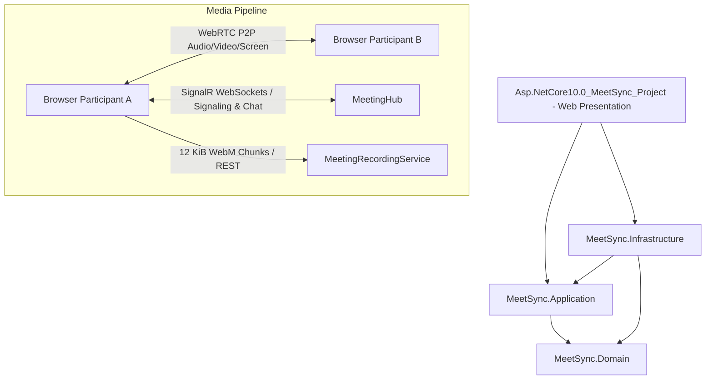
```mermaid
graph TD
    UI[Asp.NetCore10.0_MeetSync_Project - Web Presentation] --> App[MeetSync.Application]
    Infra[MeetSync.Infrastructure] --> App
    Infra --> Domain[MeetSync.Domain]
    App --> Domain
    UI --> Infra

    subgraph Media Pipeline
        ClientA[Browser Participant A] <-->|WebRTC P2P Audio/Video/Screen| ClientB[Browser Participant B]
        ClientA <-->|SignalR WebSockets / Signaling & Chat| Hub[MeetingHub]
        ClientA -->|12 KiB WebM Chunks / REST| RecService[MeetingRecordingService]
    end
```

### Proje Dizin Yapısı

```text
MeetSync/
├── Asp.NetCore10.0_MeetSync_Project/  # Presentation Layer (Controllers, Views, Hubs, wwwroot)
│   ├── Controllers/                   # AccountController, DashboardController, MeetingController
│   ├── Hubs/                          # MeetingHub (SignalR WebSocket Endpoints)
│   ├── Views/                         # Razor Views (Dashboard, Meeting, Account)
│   └── wwwroot/                       # Static Assets & JavaScript Modules (webrtc.js, quality-picker.js)
├── MeetSync.Application/              # Application Layer (DTOs, Interfaces, Service Contracts)
│   ├── DTOs/                          # Auth, Room, Recording DTOs
│   └── Interfaces/                    # IRoomService, IMeetingService, IMeetingRecordingService
├── MeetSync.Domain/                   # Domain Layer (Core Entities, Enums, Domain Exceptions)
│   ├── Entities/                      # AppUser, Room, RoomName, RoomParticipant, MeetingRecording
│   └── Enums/                         # ParticipantRole, RecordingStatus
├── MeetSync.Infrastructure/           # Infrastructure Layer (EF Core, Repositories, Services)
│   ├── Persistence/                   # MeetSyncDbContext & Migrations
│   └── Services/                      # RoomService, MeetingRecordingService, State Stores
├── screenshots/                       # Uygulama Arayüz Ekran Görüntüleri
├── tests/                             # xUnit Entegrasyon ve Birim Testleri
└── Asp.NetCore10.0_MeetSync_Project.slnx # Solution Dosyası
```

---

<a name="7-çalışma-akışı-tr"></a>
## 7. Çalışma Akışı (TR)

1. **Giriş ve Oturum Açma**: Kullanıcı sisteme giriş yapar; HTTP Session tanımlanır.
2. **Oda Seçimi / Oluşturma**: Kullanıcı ana panelden oda adı girer. `RoomService.CreateRoomAsync` veritabanı düzeyinde `sp_getapplock` kilidi alarak aynı aktif odanın mükerrer oluşturulmasını engeller.
3. **SignalR Sinyalleşme Bağlantısı**: Kullanıcı toplantı sayfasına girdiğinde `MeetingHub` sunucusuna bağlanır. Sunucu kullanıcıya `"Moderatör"` veya `"Katılımcı"` rolünü atar.
4. **WebRTC El Sıkışması (Handshake)**:
   - Yeni katılan istemci odadaki diğer katılımcılar için WebRTC `RTCPeerConnection` nesneleri oluşturur.
   - SignalR üzerinden `Offer`, `Answer` ve `ICE Candidate` paketleri aktarılır.
   - Medya aktarımı doğrudan istemciler arasında P2P olarak başlar.
5. **Ekran Paylaşımı & Kalite Değişimi**: Ekran yayıncısı çözünürlük seçtiğinde `getUserMedia` akışı güncellenir ve WebRTC izleri (tracks) dinamik olarak değiştirilir.
6. **Kayıt & Moderasyon**: Moderatör kaydı başlattığında istemci taraflı kanvas/medya birleştirici 12 KiB'lık parçaları REST API üzerinden `MeetingRecordingService` servisine yükler.

---

<a name="8-gereksinimler-ve-kurulum-tr"></a>
## 8. Gereksinimler ve Kurulum (TR)

### Gereksinimler
- **.NET 10.0 SDK** veya üzeri
- **SQL Server 2019+** veya **LocalDB**
- Modern Web Tarayıcısı (Chrome, Edge, Firefox veya Safari)

### Adım Adım Kurulum

1. **Depoyu Klonlayın**:
   ```bash
   git clone https://github.com/Terabithia1572/Asp.NetCore10.0_MeetSync_Project.git
   cd Asp.NetCore10.0_MeetSync_Project
   ```

2. **Bağımlılıkları Geri Yükleyin**:
   ```bash
   dotnet restore
   ```

3. **Veritabanını Güncelleyin (Migrations)**:
   ```bash
   dotnet ef database update --project MeetSync.Infrastructure --startup-project Asp.NetCore10.0_MeetSync_Project
   ```

4. **Projeyi Derleyin ve Çalıştırın**:
   ```bash
   dotnet build
   dotnet run --project Asp.NetCore10.0_MeetSync_Project
   ```

5. **Uygulamaya Erişin**:
   Tarayıcınızda `https://localhost:7025` veya `http://localhost:5221` adresine gidin.

---

<a name="9-yapılandırma-tr"></a>
## 9. Yapılandırma (TR)

`appsettings.json` dosyası üzerinden aşağıdaki ayarlar yapılandırılabilir:

```json
{
  "ConnectionStrings": {
    "DefaultConnection": "Server=(localdb)\\mssqllocaldb;Database=MeetSyncDb;Trusted_Connection=True;MultipleActiveResultSets=true"
  },
  "Redis": {
    "ConnectionString": "localhost:6379,abortConnect=false"
  },
  "Recording": {
    "StoragePath": "wwwroot/recordings"
  },
  "Logging": {
    "LogLevel": {
      "Default": "Information",
      "Microsoft.AspNetCore": "Warning"
    }
  }
}
```

---

<a name="10-kullanım-kılavuzu-tr"></a>
## 10. Kullanım Kılavuzu (TR)

1. **İki Farklı Tarayıcı İle Test Etme**:
   - Birinci tarayıcıda (ör. Chrome) oturum açın ve `Oda-101` adlı odayı oluşturun. Otomatik olarak moderatör olacaksınız.
   - İkinci tarayıcıda (ör. Gizli Sekme veya Edge) farklı bir hesapla giriş yapıp `Oda-101` adını girin. Aynı aktif odaya katıldığınızı ve kameraların P2P olarak bağlandığını göreceksiniz.
2. **Ekran Paylaşımı Kalitesi**:
   - Medya araç çubuğundaki **Ekran Paylaşımı** ikonunun yanındaki kalite seçiciye tıklayın (Varsayılan: `1080p`).
   - `4K`, `2K`, `1080p`, `720p` veya `480p` seçeneklerinden birini belirleyin.
3. **Oda Kilidi & Moderasyon**:
   - Moderatör olarak üst araç çubuğundaki kilit simgesine tıklayarak odaya yeni katılanları engelleyin.
   - Katılımcı listesinden herhangi bir kullanıcının mikrofonunu uzaktan kapatabilir veya odadan çıkarabilirsiniz.

---

<a name="11-testler-ve-doğrulama-tr"></a>
## 11. Testler ve Doğrulama (TR)

Çözüm içerisindeki birim ve entegrasyon testlerini çalıştırmak için:

```bash
dotnet test
```

---

<a name="12-sorun-giderme-tr"></a>
## 12. Sorun Giderme (TR)

### 🔴 SQL Server SNI / Uzun Dosya Yolu Hatası (`0x800700CE` / `Microsoft.Data.SqlClient.SNI.dll`)
- **Neden**: Windows max path sınırı nedeniyle derin klasör dizinlerinde DLL yükleme hatası.
- **Çözüm**: Proje klasörünü `C:\Projects\MeetSync` veya `D:\MeetSync` gibi kısa bir dosya yoluna taşıyıp paketleri yeniden restore edin (`dotnet restore`).

### 🔴 Kamera ve Mikrofon İzin Hataları
- **Neden**: Tarayıcı güvenlik politikaları gereği WebRTC ortam erişimi yalnızca `https://` veya `localhost` adreslerinde çalışır.
- **Çözüm**: IP adresi üzerinden test ediyorsanız HTTPS sertifikasını doğrulayın veya tarayıcı ayarlarından güvenli kaynak olarak ekleyin.

---

<a name="13-bilinen-sınırlamalar-tr"></a>
## 13. Bilinen Sınırlamalar (TR)
- Ekran paylaşımı çözünürlük seçenekleri (4K, 2K vb.) üst sınırdır; istemcinin ekran donanımı veya tarayıcı kısıtlamalarına göre dinamik olarak en yakın çözünürlüğe ölçeklenir.
- P2P bağlantıları NAT arkasındaki karmaşık ağlarda TURN sunucusu gerektirebilir (Varsayılan kurulum STUN kullanır).

---

<a name="14-katkıda-bulunma-tr"></a>
## 14. Katkıda Bulunma (TR)
1. Bu depoyu fork edin.
2. Yeni bir özellik dalı açın (`git checkout -b feature/yeni-ozellik`).
3. Değişikliklerinizi commit edin (`git commit -m 'feat: yeni özellik eklendi'`).
4. Dalınıza push yapın (`git push origin feature/yeni-ozellik`).
5. Bir Pull Request (PR) oluşturun.

---

<a name="15-geliştirici-tr"></a>
## 15. Geliştirici (TR)

**Geliştirici**: Yunus İNAN  
**GitHub**: [https://github.com/Terabithia1572](https://github.com/Terabithia1572)

---

<a name="16-lisans-ve-telif-tr"></a>
## 16. Lisans ve Telif (TR)

Bu proje **Yunus İNAN** tarafından geliştirilmiştir ve Türkçe ve İngilizce metinleri sunulan **MIT Lisansı** kapsamında yayımlanmıştır. Ayrıntılar için [LICENSE](LICENSE) dosyasına bakabilirsiniz.

Copyright (c) 2026 Yunus İNAN.

---
---

<a name="english"></a>
# 🇬🇧 English Documentation

## 1. Project Title & Overview

**Terabithia Sync — MeetSync Pro** is a high-performance, secure, and low-latency real-time video conferencing, audio communication, screen sharing, and moderation platform built on modern web technologies (.NET 10, ASP.NET Core, SignalR, and WebRTC).

### Problem Solved
As an alternative to traditional meeting applications requiring heavy desktop clients, expensive server bandwidth costs, and complex licensing; it provides a 100% browser-based (Peer-to-Peer) media streaming architecture with end-to-end encryption and enterprise-grade Clean Architecture.

### Key Value Propositions
- **Direct Browser Communication**: WebRTC P2P (`RTCPeerConnection`) minimizes server media relay costs.
- **Real-Time Moderation**: Room locking, remote mute/kick, moderator transfer, and waiting room (lobby) control.
- **Server-Side Meeting Recording**: Merges and records participant video/audio streams into 1280x720 (720p) WebM format seamlessly.
- **High-Definition Screen Sharing**: Dynamic screen quality selection from 480p up to 4K (UHD 3840x2160).

**Developer**: Yunus İNAN ([GitHub Profile](https://github.com/Terabithia1572))

---

## 2. Table of Contents (EN)
- [1. Project Title & Overview](#1-project-title--overview)
- [3. Screenshots](#3-screenshots-en)
- [4. Features](#4-features-en)
  - [Recently Added Features](#recently-added-features)
- [5. Tech Stack](#5-tech-stack-en)
- [6. Architecture](#6-architecture-en)
- [7. Workflow](#7-workflow-en)
- [8. Requirements & Installation](#8-requirements--installation-en)
- [9. Configuration](#9-configuration-en)
- [10. User Guide](#10-user-guide-en)
- [11. Testing & Verification](#11-testing--verification-en)
- [12. Troubleshooting](#12-troubleshooting-en)
- [13. Known Limitations](#13-known-limitations-en)
- [14. Contributing](#14-contributing-en)
- [15. Developer](#15-developer-en)
- [16. License & Copyright](#16-license--copyright-en)

---

<a name="3-screenshots-en"></a>
## 3. Screenshots (EN)

The refreshed application interface components and user experience screenshots are presented below:

| View | Description |
| :--- | :--- |
|  | **User Login**: Secure user authentication and session management. |
|  | **Main Dashboard**: Quick meeting start, room search, and statistics overview. |
|  | **Create Room**: Create new meeting rooms with passwords and lobby options. |
|  | **Active Rooms**: Browse and instantly join existing active meetings. |
|  | **Room Directory**: List of all ongoing live sessions. |
|  | **Waiting Room (Lobby)**: Pre-join device permission check for camera and mic. |
|  | **Participants Panel**: Live participant status, role indicators, and quick actions. |
|  | **Moderator Controls**: Mute, kick, room lock, and recording controls. |
|  | **Media Toolbar**: Quick mic, camera, and screen share toggle controls. |
|  | **Quality Selection Panel**: Screen share quality menu (480p, 720p, 1080p, 2K, 4K). |
|  | **Live Screen Sharing**: High FPS live screen stream with compact quality badge. |
|  | **Meeting Recording**: Live recording indicator, timer, and download link. |
|  | **AI Summary**: Live captions and automated NLP meeting summary. |
|  | **In-Meeting Chat**: Real-time messaging and attachment sharing panel. |

---

<a name="4-features-en"></a>
## 4. Features (EN)

### 🌟 Recently Added Features

1. **Same Active Room Joining Protection (`sp_getapplock` & Collate)**:
   - If an active room with the same name exists, a new room is not created; users join the existing active room seamlessly.
   - Database-level application locks (`sys.sp_getapplock`) prevent race conditions during concurrent creation requests.
   - Whitespace trimming (`FormC` Unicode normalization) and Turkish culture-sensitive (`Turkish_100_CI_AS`) exact matching are enforced.
   - SQL wildcard characters such as underscores (`_`) are safely handled.

2. **Meeting Recording Engine (MediaRecorder Stream Chunking)**:
   - One-click start/stop triggered by room moderators.
   - Audio and video streams are chunked in 12 KiB slices and assembled on the server at `wwwroot/recordings` into standard 1280x720 (720p) WebM files.
   - Preserves fixed recording resolution regardless of client screen share resolution changes.
   - Provides an instant download link upon recording completion.

3. **Advanced Screen Sharing & Resolution Picker**:
   - Dynamic WebRTC SDP re-negotiation for on-the-fly resolution switching:
     - **480p**: 854 × 480 @ 30 FPS
     - **720p**: 1280 × 720 @ 30 FPS
     - **1080p**: 1920 × 1080 @ 30 FPS
     - **2K / QHD**: 2560 × 1440 @ 30 FPS
     - **4K / UHD**: 3840 × 2160 @ 30 FPS
   - Toolbar-integrated compact quality badge button with an accessible popover picker.
   - Automatic screen stream forwarding to late-joining participants.

4. **Room Locking Mechanism**:
   - Minimalist lock icon button integrated into the top bar with active status colors and tooltips.
   - Server-validated room lock state preventing new participants from joining locked rooms.

5. **Moderator & Participant Role Enforcement**:
   - Universal button visibility: Privileged actions (Record, Lock Room, Mute All, End Meeting) are active for moderators and disabled with informative tooltips for participants.
   - Role badge: `"You: Moderator"` / `"You: Participant"`.
   - Automatic host handover and interface updates when the current moderator leaves.

---

<a name="5-tech-stack-en"></a>
## 5. Tech Stack (EN)

| Layer | Technology / Library | Version |
| :--- | :--- | :--- |
| **Framework** | .NET / ASP.NET Core | `10.0` |
| **ORM / Database** | Entity Framework Core, SQL Server | `10.0` / `2019+` |
| **Real-Time Communication** | ASP.NET Core SignalR | `10.0` |
| **Media & P2P** | WebRTC (RTCPeerConnection, MediaDevices, MediaRecorder) | Native Browser API |
| **State Storage** | `IMeetingStateStore` (In-Memory / Redis Backplane) | Built-in / StackExchange.Redis |
| **Validation & Logging** | FluentValidation, Serilog | `11.x` / `4.x` |
| **Frontend** | HTML5, Vanilla JavaScript (ES6+), CSS3 (Stitch UI Theme) | ES2022 |
| **Test Framework** | xUnit, Microsoft.AspNetCore.Mvc.Testing | `2.9.x` |

---

<a name="6-architecture-en"></a>
## 6. Architecture (EN)

The project strictly follows **Clean Architecture** principles and layered design patterns:

```text
MeetSync/
├── Asp.NetCore10.0_MeetSync_Project/  # Presentation Layer (Controllers, Views, Hubs, wwwroot)
├── MeetSync.Application/              # Application Layer (DTOs, Interfaces, Service Contracts)
├── MeetSync.Domain/                   # Domain Layer (Core Entities, Enums, Domain Exceptions)
├── MeetSync.Infrastructure/           # Infrastructure Layer (EF Core, Repositories, Services)
├── screenshots/                       # Application Interface Screenshots
└── tests/                             # xUnit Unit & Integration Tests
```

---

<a name="7-workflow-en"></a>
## 7. Workflow (EN)

1. **Authentication**: User logs into the platform; an HTTP Session cookie is issued.
2. **Room Creation / Join**: User enters a room name on the dashboard. `RoomService.CreateRoomAsync` uses `sp_getapplock` to prevent duplicate active room creation.
3. **SignalR Connection**: User joins the meeting page and connects to `MeetingHub`. The server assigns `"Moderator"` or `"Participant"` roles.
4. **WebRTC Peer Handshake**:
   - The joining client creates WebRTC `RTCPeerConnection` instances for all active participants in the room.
   - `Offer`, `Answer`, and `ICE Candidate` signals are exchanged over SignalR.
   - P2P video/audio streaming begins directly between browsers.
5. **Screen Share & Quality Switch**: Choosing a new resolution triggers `getUserMedia` constraint updates and dynamic WebRTC track replacement.
6. **Recording Engine**: Moderator starts recording; client-side media chunks (12 KiB) are posted via REST API to `MeetingRecordingService`.

---

<a name="8-requirements--installation-en"></a>
## 8. Requirements & Installation (EN)

### Prerequisites
- **.NET 10.0 SDK** or higher
- **SQL Server 2019+** or **LocalDB**
- Modern Web Browser (Chrome, Edge, Firefox, or Safari)

### Quick Start Commands

```bash
# 1. Clone the repository
git clone https://github.com/Terabithia1572/Asp.NetCore10.0_MeetSync_Project.git
cd Asp.NetCore10.0_MeetSync_Project

# 2. Restore NuGet dependencies
dotnet restore

# 3. Apply EF Core Migrations
dotnet ef database update --project MeetSync.Infrastructure --startup-project Asp.NetCore10.0_MeetSync_Project

# 4. Build and run the solution
dotnet build
dotnet run --project Asp.NetCore10.0_MeetSync_Project
```

Open your browser at `https://localhost:7025` or `http://localhost:5221`.

---

<a name="9-configuration-en"></a>
## 9. Configuration (EN)

Configure database connection strings and storage paths in `appsettings.json`:

```json
{
  "ConnectionStrings": {
    "DefaultConnection": "Server=(localdb)\\mssqllocaldb;Database=MeetSyncDb;Trusted_Connection=True;MultipleActiveResultSets=true"
  },
  "Redis": {
    "ConnectionString": "localhost:6379,abortConnect=false"
  },
  "Recording": {
    "StoragePath": "wwwroot/recordings"
  }
}
```

---

<a name="10-user-guide-en"></a>
## 10. User Guide (EN)

1. **Testing with Two Browsers**:
   - Open Browser 1 (e.g. Chrome), log in, and create `Room-101`. You will become the moderator.
   - Open Browser 2 (e.g. Incognito or Edge), log in with a second account, and join `Room-101`. Both participants will connect via P2P.
2. **Screen Share Quality**:
   - Click the quality dropdown next to the **Screen Share** button (Default: `1080p`).
   - Select `4K`, `2K`, `1080p`, `720p`, or `480p`.
3. **Room Lock & Moderation**:
   - Click the top bar lock icon as a moderator to block new entrants.
   - Use the participant list to remotely mute audio or remove participants.

---

<a name="11-testing--verification-en"></a>
## 11. Testing & Verification (EN)

To execute unit and integration test suites:

```bash
dotnet test
```

---

<a name="12-troubleshooting-en"></a>
## 12. Troubleshooting (EN)

### 🔴 SQL Server SNI / Long Path Error (`0x800700CE` / `Microsoft.Data.SqlClient.SNI.dll`)
- **Cause**: Windows maximum path length limitation in deeply nested directories.
- **Fix**: Move the project folder to a shorter path (e.g. `C:\Projects\MeetSync` or `D:\MeetSync`) and run `dotnet restore`.

### 🔴 Camera / Microphone Permission Denied
- **Cause**: WebRTC media devices require secure contexts (`https://` or `localhost`).
- **Fix**: Verify HTTPS SSL certificates or add the domain to trusted origins in browser settings.

---

<a name="13-known-limitations-en"></a>
## 13. Known Limitations (EN)
- Screen share resolutions (4K, 2K, etc.) are target caps; browsers dynamically scale resolution based on physical display hardware.
- STUN servers are configured by default; restrictive enterprise networks behind symmetric NATs may require a TURN server.

---

<a name="14-contributing-en"></a>
## 14. Contributing (EN)
1. Fork the project repository.
2. Create your feature branch (`git checkout -b feature/amazing-feature`).
3. Commit your changes (`git commit -m 'feat: add amazing feature'`).
4. Push to the branch (`git push origin feature/amazing-feature`).
5. Open a Pull Request.

---

<a name="15-developer-en"></a>
## 15. Developer (EN)

**Developer**: Yunus İNAN  
**GitHub**: [https://github.com/Terabithia1572](https://github.com/Terabithia1572)

---

<a name="16-license--copyright-en"></a>
## 16. License & Copyright (EN)

This project was developed by **Yunus İNAN** and is released under the **MIT License** provided in Turkish and English. See the [LICENSE](LICENSE) file for details.

Copyright (c) 2026 Yunus İNAN.
